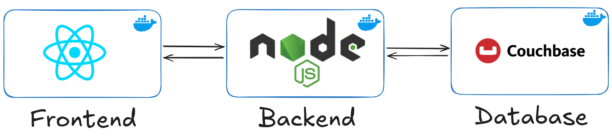
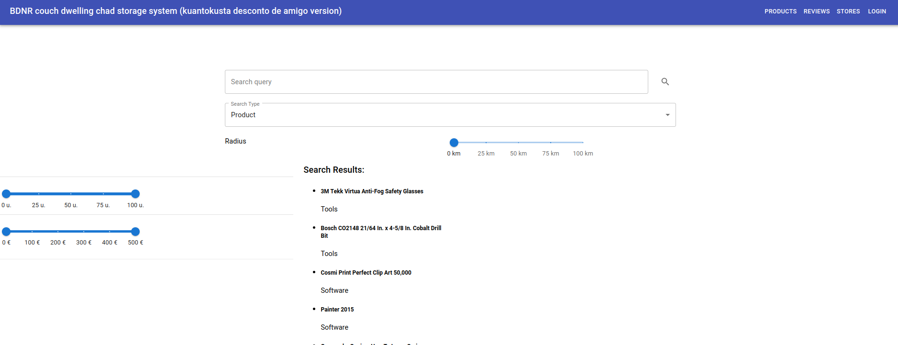
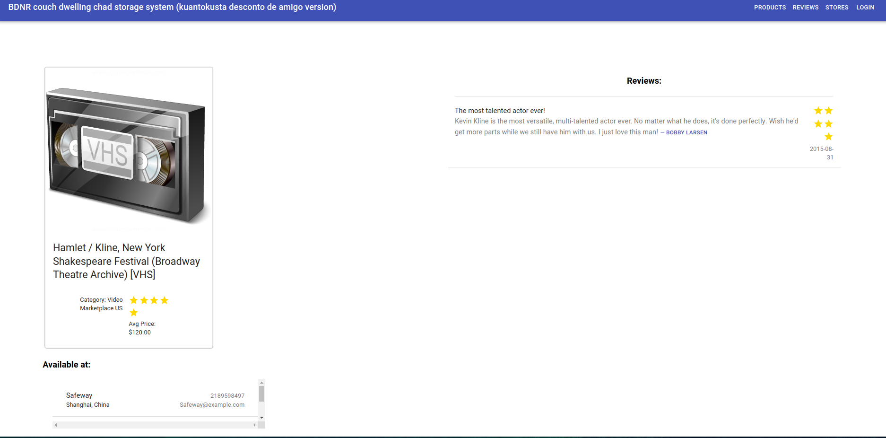
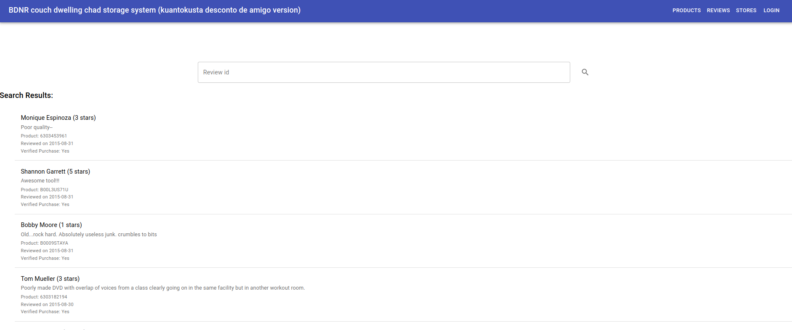
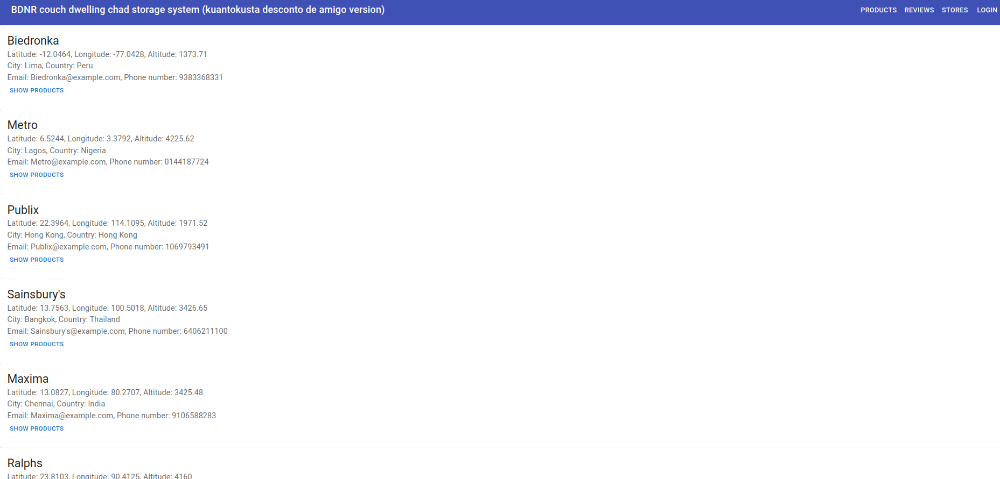

# FEUP-BDNR 

## Description 

A store management system built on top of real-life reviews, using the react, express and node.js frameworks for the application and the NoSQL Couchbase database for the data storage.

## Features

A fully functional store management system with: 
 - A frontend in React JS 
 - A backend in Node JS
 - A database instance of Couchbase, a NoSQL document-based database. It incorporates features such as transactions, events (triggers), full-text search, and geo-spatial queries.

Read more about it in our final presentation [here](./docs/Couchbase%20-%20Final%20presentation%20-%20G03%20.pdf).

## Contributors 

- António Ribeiro ([@francisco-rente](https://github.com/francisco-rente))
- Gabriel Martins ([@Gabm-01](https://github.com/Gabm-01))
- Pedro Pinheiro ([@PPinhas](https://github.com/PPinhas))


## Project's architecture




## Database schema and available queries


## Instructions 

> :warning: **Datasets**: As of this moment the links used to gather the datasets from amazon buckets are not available. As such the data retrieval and processing pipeline in [data](./data/Makefile) is invalid. The datasets are therefore *included* in this repository.

### Docker 

Install docker and docker compose in your machine. Run docker compose to start the database and the backend server.

```bash
docker compose up
```
Open the browser and go to `http://localhost:3000/` to access the application. The database dashboard is available at `http://localhost:8091/`, with admin:password login.

## Some pictures of the application

### Home page


### Product page


### Reviews Page


### Stores Page

 


