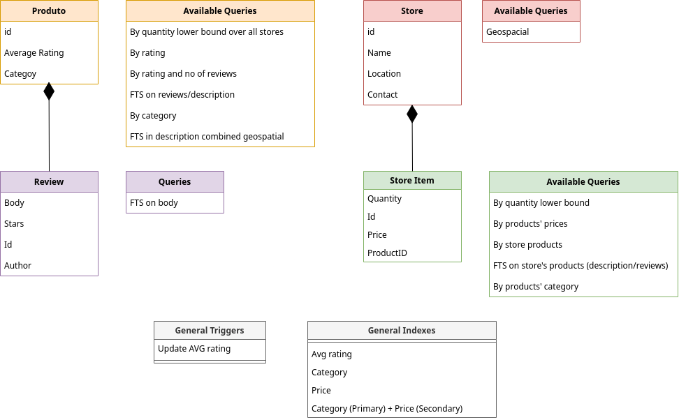

# FEUP-BDNR 

## Description 

A store management system built on top of real-life reviews, using the react, express and node.js frameworks for the application and the NoSQL Couchbase database for the data storage.

## Contributors 

- António Ribeiro ([@francisco-rente](https://github.com/francisco-rente))
- Gabriel Martins ([@Gabm-01](https://github.com/Gabm-01))
- Pedro Pinheiro ([@PPinhas](https://github.com/PPinhas))

## Database schema and available queries

